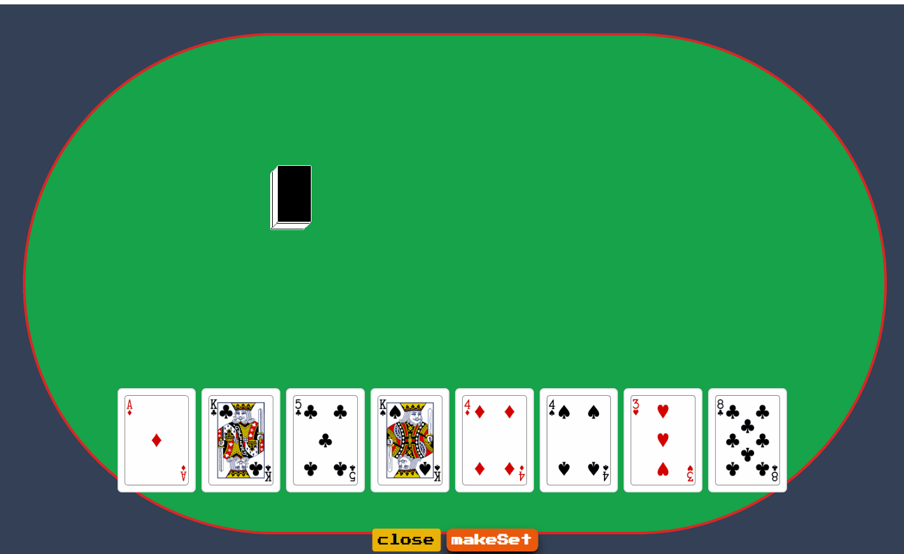
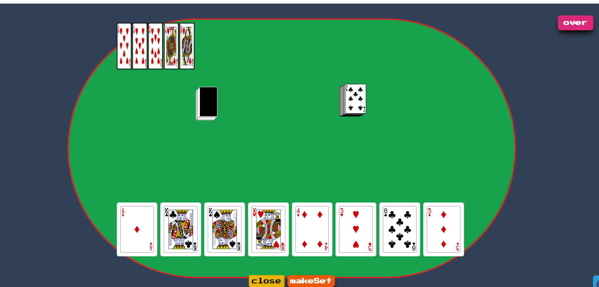
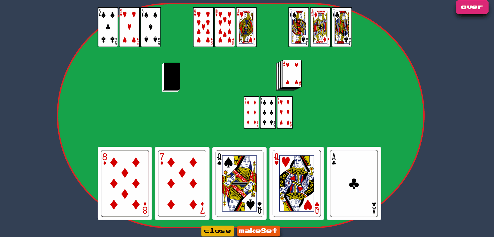
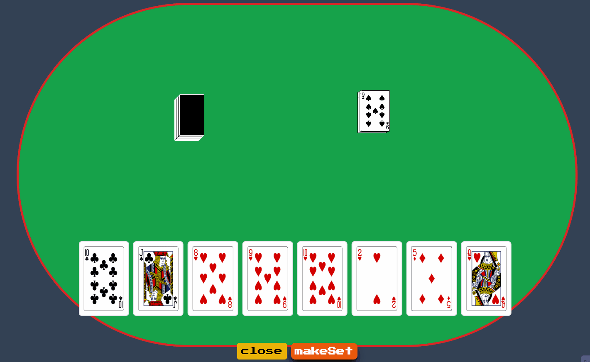

# 🃏 Conqueror Jockey

> A **real-time 5-player multiplayer card game** built with **React, TypeScript, WebSockets**, and **Recoil** — featuring smooth animations, synchronized gameplay, and dynamic player perspectives.

🎮 **Live Demo:** [https://conquerorjockey.vercel.app/](https://conquerorjockey.vercel.app/)  
💻 **Source Code:** [https://github.com/akasmikityma/Jockey_Game](https://github.com/akasmikityma/Jockey_Game)

---

## 🚀 Overview

Conqueror Jockey is a multiplayer card game designed to test your speed, strategy, and synchronization.  
It supports **up to 5 players**, all connected in real-time through WebSockets, with seamless updates and animations for every move.

Built with modern web technologies, this project focuses on **real-time state management**, **player synchronization**, and **a smooth gameplay experience** in the browser.

---

## 🧠 Features

- 🧩 **Real-Time Gameplay:** All player actions are synced live using WebSockets.  
- 🎯 **Card Validation Logic:** Checks for valid sets, sequences, and wildcard combinations.  
- 🧮 **Game Manager System:** Handles distribution, draw deck, givebacks, and winner logic server-side.  
- 🎭 **Dynamic Player Perspective:** Every client sees themselves as *Player 3* for consistent UI orientation.  
- ⚡ **Optimized State Updates:** Built with Recoil to minimize re-renders and ensure smooth UX.  
- 💫 **Animations & Transitions:** TailwindCSS + motion-based effects for a lively experience.  

---

## ⚙️ Tech Stack

**Frontend**
- React.js  
- TypeScript  
- Recoil (for state management)  
- TailwindCSS (for styling)

**Backend**
- Node.js  
- Express.js  
- WebSocket (ws library)

**Deployment**
- Vercel (Frontend)  
- Render (Backend)

---

## 🧩 Architecture Overview

Client (React + Recoil)
│
├── emits player actions
│
WebSocket Server (Node + Express)
│
├── updates authoritative game state
│
All Clients ← broadcast updated state


## 🖼️ Gameplay Screenshots & GIFs 👇  

### 🎮 Gameplay Preview  
*(GIF showing live multiplayer table — players drawing, giving back, and placing sets)*  
 
 Gif of a player taking card from remaining unknown cards and then giving a card back from whatever he has including the just-taken one
 
 
 GIF showing player creating a set and submitting as valid one
 
 
 GIF showing player adding one or multiple cards to the existing sets
 

 GIF showing player using one or multiple Jockey cards to create valid set
 

### 🧍 Lobby / Waiting Screen  
*(Static image of player lobby before game starts)*  


### 🧩 Card Interaction  
*(GIF showing drag/drop or give-back interaction)*  



---

## 🧪 Local Setup

To run the project locally:

```bash
# Clone the repo
git clone https://github.com/akasmikityma/Jockey_Game.git
cd Jockey_Game

# Install dependencies (for both frontend and backend)
cd frontend
npm install
cd ../backend
npm install

# Run both servers
npm run dev  # (adjust based on your setup)
